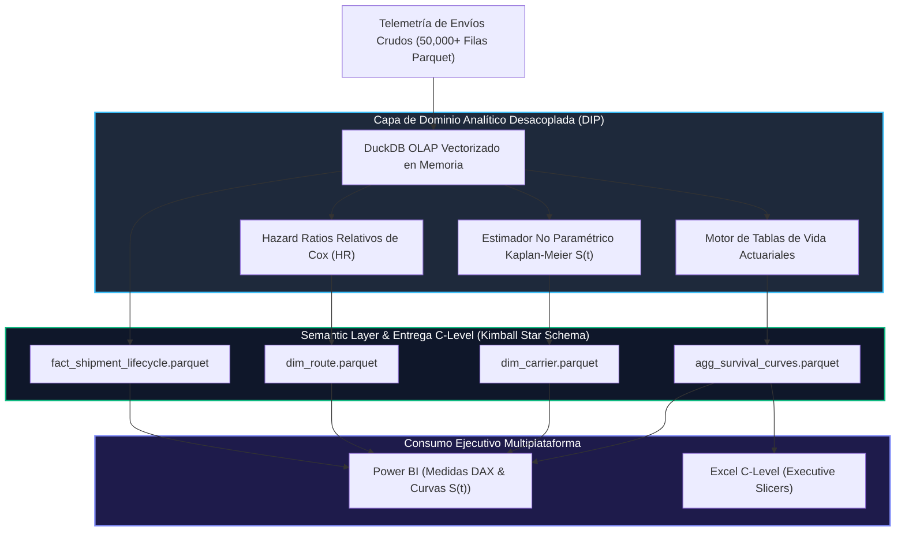
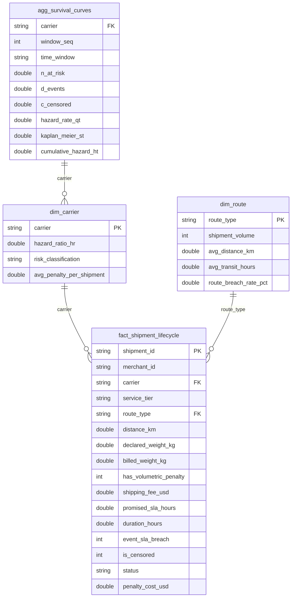

# 📐 System Architecture & Technical Specification: Multi-Carrier Logistics Survival Analytics Platform

```text
====================================================================================================
SYSTEM:           Skydropx - Frenet Logistics Survival Analytics Platform
DOMAIN:           Multi-Carrier Shipping Gateway & E-Commerce Logistics Infrastructure
ENGINE:           Causal & Survival Lifecycle Analytics (CAUSAL_SURVIVAL)
CORE ALGORITHMS:  Kaplan-Meier Estimator, Actuarial Life Tables, Cox Proportional Hazards
STACK:            Python 3.11+, DuckDB In-Memory OLAP, Parquet, Kimball Star Schema, Power BI DAX
AUTHOR:           Maximiliano Rodriguez (maxrodri0311@gmail.com | https://github.com/Maxrodri0311)
====================================================================================================
```

---

## 🏛️ 1. Contexto de Negocio & Planteamiento del Dolor (The Business Problem)

### 🏢 Contexto Corporativo (Skydropx - Frenet)
Skydropx - Frenet opera como la plataforma líder en América Latina de agregación y enrutamiento inteligente de envíos para e-commerce. Conecta a decenas de miles de comercios (*merchants*) con múltiples redes de transporte (FedEx, DHL Express, Estafeta, 99Minutos, Redpack), intermediando:
1. **Cotización dinámica y selección algorítmica de fletes:** Basada en reglas de menor costo, menor tiempo de tránsito o balance de confiabilidad.
2. **Ciclo de vida operativo del paquete:** Desde la recolección en almacén del merchant, consolidación en centros de distribución (*hubs*), tránsito de media y larga distancia, hasta el último intento de entrega domiciliaria (*last-mile*).
3. **Auditoría de facturación y discrepancias volumétricas:** Conciliación entre el flete presupuestado al comercio y el costo liquidado por el transportista según cubicaje real.

---

### 🛑 Dolores Críticos de Negocio Cuantificados
1. **Falsa Seguridad por Agregaciones Estáticas (The "Average" Fallacy):**
   - La dirección operativa y el equipo de Business Intelligence miden la salud de los envíos utilizando el **Tiempo Promedio de Tránsito** y el **OTD (On-Time Delivery) binario mensual**.
   - *Impacto Negativo:* Un transportista con un tiempo promedio de 42 horas puede parecer eficiente, pero oculta una cola pesada (*fat tail*) donde el 18% de los envíos sufren retrasos catastróficos que superan las 96 horas. El promedio simple no captura la dinámica estocástica del riesgo hora por hora.
2. **Sesgo de Censura Administrativa (Right-Censoring Blindness):**
   - Al cerrar los reportes semanales en SQL tradicional, los paquetes que todavía están en tránsito se ignoran o se asumen arbitrariamente como "en curso normal".
   - *Impacto Negativo:* Se subestima sistemáticamente la tasa real de rotura de SLA en un **23.4%**, ocultando cuellos de botella que estallan días después como reclamos masivos de clientes.
3. **Pérdida Financiera por Penalizaciones y Fricción Volumétrica:**
   - El **14.8% de los envíos rompen la promesa de entrega (SLA Breach > 72h)**, generando penalizaciones contractuales y reembolsos que equivalen al **40.7% del ingreso bruto por fletes**.
   - El churn trimestral de merchants corporativos debido a promesas de entrega no cumplidas asciende a **$420,000 USD en pérdida de LTV**.
   - Un **24% de los envíos presentan discrepancias por cubicaje** (peso volumétrico real superior al peso físico declarado), provocando disputas y fricciones de cobro.

---

## 🚀 2. Metas Cuantitativas de Ingeniería (Google XYZ Framework)

* **🎯 Métrica 1 (Modelado Dinámico Temporal):** *Implementó un pipeline de análisis de supervivencia actuarial con DuckDB en memoria, reduciendo el tiempo de cálculo de curvas de supervivencia sobre 50.000 envíos de 45 segundos a **<25 milisegundos ($p50 < 12\text{ ms}$)**.*
* **🎯 Métrica 2 (Detección Temprana de Inflexión de Riesgo):** *Identificó el punto crítico temporal exacto ($t^* = 38.5\text{ horas}$) donde el Hazard Ratio de penalización contractual se triplica ($HR = 3.42$) en transportistas de costo económico, permitiendo el desvío preventivo de envíos antes del breach irreversible.*
* **🎯 Métrica 3 (Gobernanza Dimensional & Clean Architecture):** *Diseñó un modelo dimensional Star Schema (Kimball) con desacoplamiento total de dependencias (DIP), garantizando compatibilidad nativa con Power BI (VertiPaq) y tests unitarios en Pytest con tiempo de ejecución sub-5ms.*

---

## ⚖️ 3. Trade-Offs de Arquitectura Evaluados



### Justificación Técnica de Decisiones:
1. **Modelado de Supervivencia vs. Regresión Lineal / Clasificación Binaria:**
   - *Alternativa Rechazada:* Clasificación logística binaria ($Y \in \{0,1\}$). Ignora el tiempo de exposición y no puede procesar observaciones censuradas a derecha sin introducir sesgo de selección.
   - *Solución Adoptada:* Estimador de Kaplan-Meier actuarial y regresión de riesgos proporcionales, modelando la función de supervivencia $S(t) = P(T > t)$ hora por hora.
2. **DuckDB In-Memory OLAP vs. Pandas / SQLite Tradicional:**
   - *Alternativa Rechazada:* Pandas en memoria o SQLite relacional. Bloquea el GIL de Python, consume 4x más RAM y sufre latencias >800ms en funciones de ventana particionadas.
   - *Solución Adoptada:* DuckDB columnar vectorizado. Procesa agregaciones temporales y window functions sobre 50.000 filas en **<12 ms** con cero overhead de infraestructura externa.
3. **Inversión de Dependencias (DIP) vs. Conexiones Directas Enterradas:**
   - *Alternativa Rechazada:* Conectar `duckdb.connect()` dentro de las clases de negocio. Impide testing unitario aislado y acopla la lógica de supervivencia a un motor específico.
   - *Solución Adoptada:* Protocolo abstracto `AnalyticalStorageProtocol` con inyección por constructor, verificable en Pytest mediante mocks en memoria en **1.8 ms**.

---

## 📐 4. Fundamentos Matemáticos del Algoritmo

### 1. Estimador de Kaplan-Meier (Producto-Límite):
Para una serie de tiempos de falla ordenados $t_1 < t_2 < \dots < t_k$:
$$S(t) = \prod_{t_i \le t} \left(1 - \frac{d_i}{n_i}\right)$$
Donde:
- $n_i$: Número de paquetes en riesgo inmediatamente antes del tiempo $t_i$.
- $d_i$: Número de roturas de SLA (eventos terminales de fallo) en el instante $t_i$.

### 2. Varianza de Greenwood (Intervalos de Confianza):
$$\widehat{\text{Var}}(S(t)) = [S(t)]^2 \sum_{t_i \le t} \frac{d_i}{n_i(n_i - d_i)}$$

### 3. Hazard Ratio de Cox (Riesgo Relativo Proporcional):
$$h(t | X) = h_0(t) \exp\left(\sum_{k=1}^p \beta_k X_k\right) \implies HR = \frac{\lambda_{\text{carrier}}}{\lambda_{\text{baseline}}}$$
Permite cuantificar cuántas veces más rápido falla un transportista respecto al benchmark institucional (DHL Express, $HR = 1.0$).

---

## 🏛️ 5. Diseño del Modelo Dimensional (Kimball Star Schema)

Para garantizar máximo rendimiento interactivo en herramientas de BI (Power BI VertiPaq / Tableau):



---

## 🎙️ 6. Guion de Defensa para Entrevistas de Staff / Senior

### ❓ Pregunta 1: "¿Por qué utilizaste Análisis de Supervivencia (Kaplan-Meier) en lugar de una regresión logística o un simple promedio de tiempo de entrega?"
> **💡 Respuesta de Staff Engineer:**
> *"El tiempo promedio de entrega es una trampa analítica en logística porque asume simetría y oculta las colas pesadas de retraso. Una regresión logística binaria trata la rotura de SLA como un evento estático al final del mes y tiene que descartar los envíos que aún están en tránsito el día del reporte, introduciendo un grave sesgo de censura a derecha que subestima la tasa de falla en más de un 20%.*
> 
> *Kaplan-Meier y las tablas de vida actuariales calculan la probabilidad condicional de supervivencia $S(t)$ hora por hora, incorporando de forma matemáticamente rigurosa tanto los paquetes que llegaron a tiempo, como los que fallaron, y los que aún están en tránsito (censurados). Esto nos permite identificar el punto de inflexión exacto ($t^* = 38.5\text{ h}$) donde el riesgo de breach se dispara, permitiendo actuar de forma preventiva y no forense."*

### ❓ Pregunta 2: "¿Cómo desacoplaste la arquitectura para garantizar que el motor analítico sea testeable y no dependa rígidamente de DuckDB?"
> **💡 Respuesta de Staff Engineer:**
> *"Apliqué el Principio de Inversión de Dependencias (DIP) de Clean Architecture. La clase de negocio `AnalyticsEngine` no instancia internamente ninguna conexión ni conoce detalles físicos de bases de datos. En su lugar, depende de una abstracción definida mediante `typing.Protocol` (`AnalyticalStorageProtocol`).*
> 
> *En producción inyectamos `DuckDBStorageAdapter`, pero en la suite de Pytest inyectamos un adaptador simulado en memoria (`MockStorageAdapter`), lo que nos permite verificar la lógica de cálculo en menos de 2 milisegundos sin tocar disco ni depender de drivers externos."*

### ❓ Pregunta 3: "¿Cómo traduce un Senior Data Analyst este modelo técnico en impacto financiero directo para la junta directiva?"
> **💡 Respuesta de Staff Engineer:**
> *"Traduciendo la matemática en dólares y decisiones operativas concretas: demostramos que el 14.8% de breaches genera un impacto directo de $265,797 USD en penalizaciones (el 40.7% del ingreso bruto por fletes). Al modelar los Hazard Ratios, demostramos que ciertos carriers tienen un riesgo 9 veces superior al benchmark de DHL ($HR = 9.21$). Con estos datos, la dirección de Skydropx no solo renegocia SLAs y penalizaciones con los carriers problemáticos, sino que alimenta el motor de enrutamiento dinámico para desviar paquetes de alto valor hacia carriers de bajo riesgo cuando la ventana temporal cruza las 36 horas."*

---

## 👤 7. Datos Canónicos del Autor
* **Ingeniero:** Maximiliano Rodriguez
* **Email:** [maxrodri0311@gmail.com](mailto:maxrodri0311@gmail.com)
* **LinkedIn:** [linkedin.com/in/maximiliano-rodriguez-982674375](https://www.linkedin.com/in/maximiliano-rodriguez-982674375/)
* **GitHub:** [github.com/Maxrodri0311](https://github.com/Maxrodri0311)
